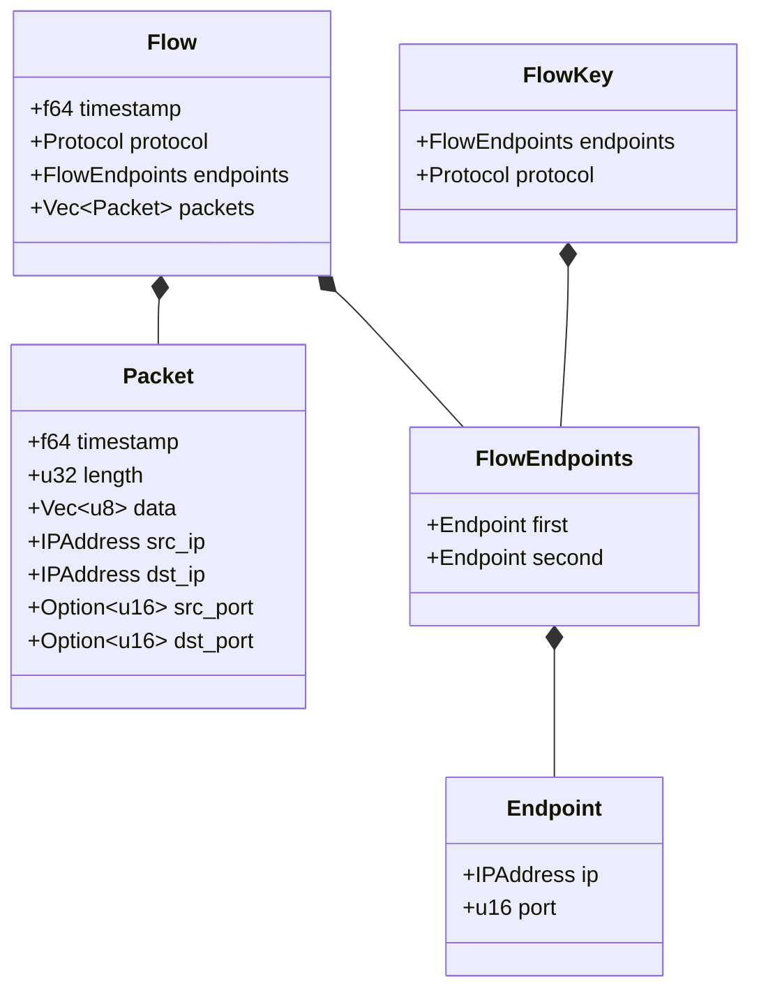
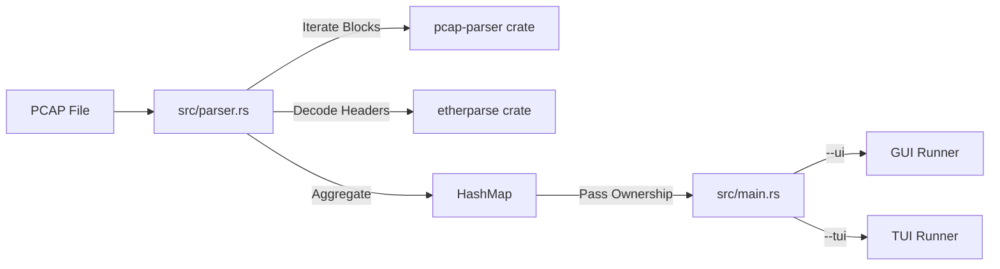
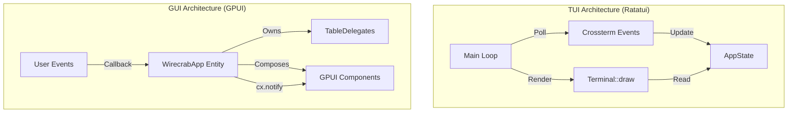

# Wirecrab Architecture

Wirecrab is a packet analysis tool written in Rust. It supports parsing PCAP files and visualizing the data through two different user interfaces: a Terminal User Interface (TUI) and a Graphical User Interface (GUI).

## Core Architecture

The core logic is separated from the presentation layers.

### Data Models (`src/flow.rs`)

- **Packet**: Represents a single captured packet with timestamp, length, and raw data.
- **Flow**: Represents a bidirectional stream of packets between two endpoints (IP:Port pairs). It aggregates individual `Packet`s.
- **FlowKey**: A canonical key used to identify a flow, consisting of sorted endpoints and the protocol. This ensures packets from A->B and B->A map to the same flow.

### Ingestion (`src/parser.rs`)

- Uses `pcap-parser` to iterate over blocks in a PCAPNG file.
- Uses `etherparse` to decode Ethernet, IP, and Transport layer headers.
- Aggregates packets into `Flow`s stored in a `HashMap<FlowKey, Flow>`.
- **Note**: The parser currently loads the entire file into memory.

## User Interface Architectures

The application is designed to support multiple frontends by decoupling the data loading from the run loop.

### TUI Architecture (`src/tui/`)
- **Library**: Built with `ratatui` and `crossterm`.
- **Structure**:
  - **Immediate Mode**: The TUI runs a main loop that redraws the entire screen on every tick or input event.
  - **State Management**: `AppState` holds the loaded flows and UI state (selected row, filter string, etc.).
  - **Widgets**: Custom widgets (like `PacketTableState`) encapsulate logic for specific views.
- **Input Handling**: Raw terminal input is captured and processed in the main loop to update the `AppState`.

### GUI Architecture (`src/gui/`)
- **Library**: Built with `gpui` (Zed's UI framework).
- **Structure**:
  - **Component-Based**: The UI is built from a tree of views/components.
  - **Event-Driven**: Unlike the TUI's polling loop, GPUI is event-driven. User actions trigger callbacks that update the model and request a re-render.
  - **State Management**:
    - `WirecrabApp` is the root view/model.
    - It holds `Entity` references to child components (like `TableState`).
    - `gpui-component` is used for high-level widgets (Tables, Inputs).
- **Data Flow**:
  - The `WirecrabApp` owns the `HashMap` of flows.
  - It passes data down to delegates (`FlowTableDelegate`, `PacketTableDelegate`).
  - Delegates implement `TableDelegate` traits to define how rows are rendered.

## Directory Structure

- `src/main.rs`: Entry point. Handles CLI args and dispatches to TUI or GUI.
- `src/parser.rs`: PCAP parsing logic.
- `src/flow.rs`: Core data structures.
- `src/gui/`: GPUI implementation.
- `src/tui/`: Ratatui implementation.
