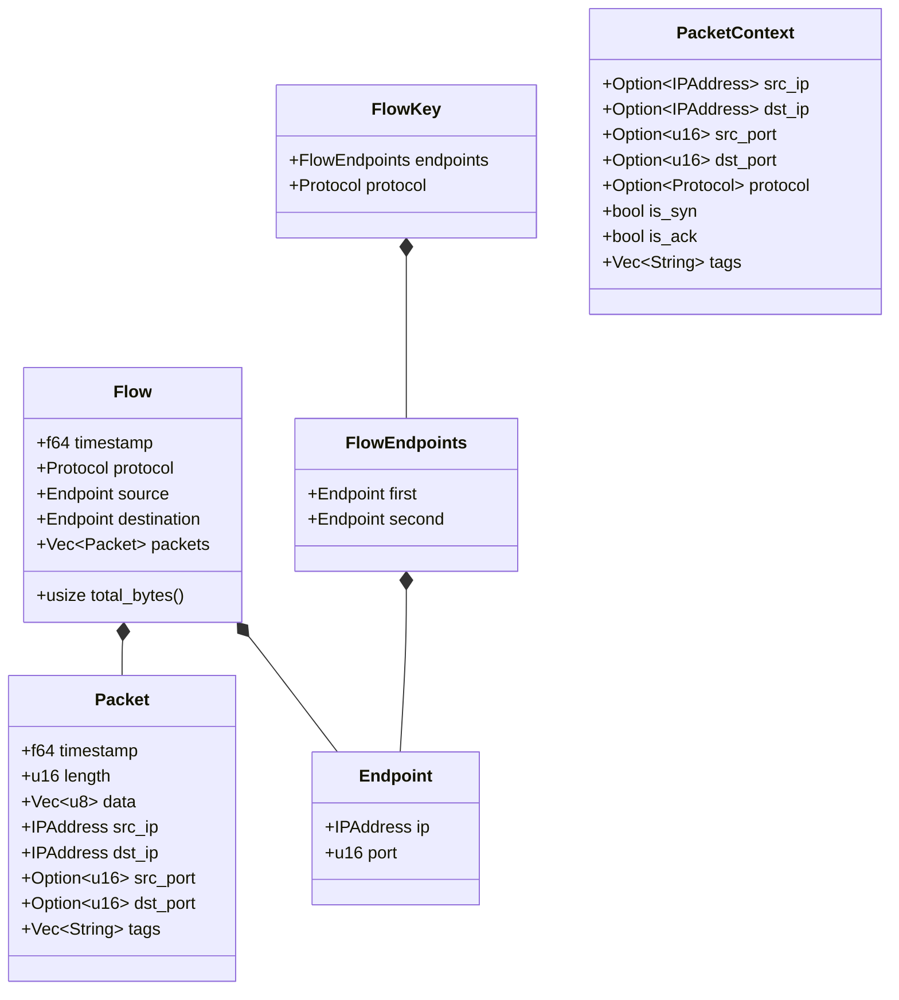
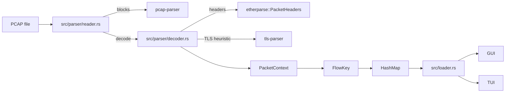
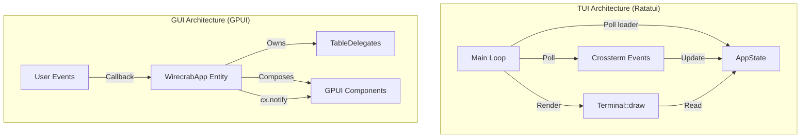

- **Layout System**:
    - `Layout` composes a header, main content, and an optional closable bottom section. The bottom section currently hosts a `BottomSplit` with the packet table on the left and the packet-bytes pane on the right.
    - Close behavior is implemented with GPUI listeners. When the close button fires, the listener clears the selected flow/packets and the UI collapses back to the two-pane layout.
    - `BottomSplit` reuses `ResizableState` so pane widths/heights persist across renders, mirroring the UX of native inspector panes.
### File Loading Lifecycle (`src/loader.rs`)

- **`Loader`**: Spawns a background thread that runs `parser::parse_pcap`, pushing `LoadStatus::Progress`, `::Loaded`, or `::Error` messages through an `mpsc` channel.
- **`FlowLoadController`**: Owns the loader and exposes a non-blocking `poll` API that returns a `FlowLoadStatus`. It keeps the latest progress percentage so UIs can render determinate progress bars while the worker thread streams updates.
- **GUI Flow**: `WirecrabApp` schedules a periodic `check_loader` task via `schedule_update`. Once `FlowLoadStatus::Ready` is observed, the flows map and optional `start_timestamp` are stored, the loader is dropped, and subsequent polls return `Idle`.
- **TUI Flow**: The TUI main loop polls the same controller at the top of every tick before handling input, enabling consistent progress/error reporting without blocking the terminal UI.

# Wirecrab Architecture

Wirecrab is a packet analysis tool written in Rust. It parses PCAP files and visualizes network flows in either a Terminal User Interface (TUI) or a Graphical User Interface (GUI). Core parsing, data modeling, and loading are decoupled from both UIs.

## Core Architecture

### Data Models (`src/flow/mod.rs`)

- **Packet**: Captured packet with timestamp, saturated length (`u16`), raw bytes, and optional ports plus tags from higher-layer parsing.
- **Flow**: Bidirectional aggregation of packets keyed by canonicalized endpoints + protocol. Includes helpers like `total_bytes()` for UI summaries.
- **FlowKey**: Stable flow identity built from sorted endpoints and protocol to group both directions.
- **PacketContext**: Transient metadata container filled during decoding (IPs, ports, protocol, TCP flags, TLS tags) before constructing a `Packet`.

### Ingestion (`src/parser/` + `src/layers/`)

Parsing is centralized in the `parser` module:

- **Reader**: Iterates PCAP-NG blocks, tracks per-interface timestamp resolution, and streams progress. For each Ethernet packet, it decodes headers, stamps timestamps, and inserts `Packet`s into the appropriate flow.
- **Decoder**: Uses `etherparse::PacketHeaders::from_ethernet_slice` to populate `PacketContext` (IPs, ports, protocol, TCP flags). A small TLS heuristic (`looks_like_tls`) gates `tls-parser` to add TLS handshake/application tags without failing the decode path.
- **Aggregation**: Packets are pushed into a `HashMap<FlowKey, Flow>`, swapping source/destination on TCP SYN to honor initiator direction. The earliest timestamp is kept as an optional origin for relative displays.

### Loading (`src/loader.rs`)

- `Loader` spawns a background thread that runs `parser::parse_pcap`, emitting `LoadStatus` messages (progress/loaded/error) over `mpsc`.
- `FlowLoadController` polls non-blockingly to surface progress to either UI and hands off the final flow map plus the optional capture start timestamp.

## User Interface Architectures

The UIs consume the same flow data and loader API.

### TUI (`src/tui/`)
- Built with `ratatui` + `crossterm`.
- Immediate-mode redraw each tick/input; `AppState` holds flows, selection, filter, etc.
- Custom widgets (e.g., packet table) render directly from the flow map.

### GUI (`src/gui/`)
- Built with `gpui` / `gpui-component`.
- Event-driven components and delegates render tables and panes using shared flow data.

## Directory Structure (selected)

- `src/main.rs`: CLI entry; chooses GUI/TUI.
- `src/parser/`: PCAP reader (`reader.rs`) and header decoder (`decoder.rs`); re-exports `parse_pcap` in `mod.rs`.
- `src/loader.rs`: Background loader and polling controller.
- `src/flow/`: Core flow/packet models and filters.
- `src/layers/`: Shared parsing structs (currently TLS tagging and `PacketContext`).
- `src/gui/`: GPUI implementation.
- `src/tui/`: Ratatui implementation.
